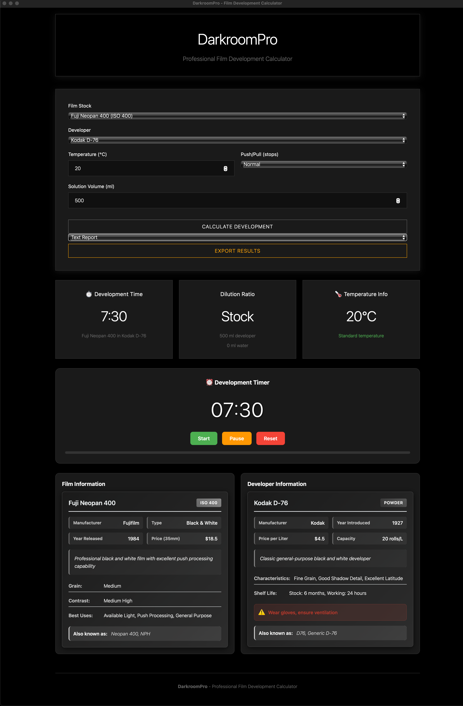

# 🧪 DarkroomPro

A professional desktop application for calculating **precise film development parameters** with scientifically accurate timing, temperature compensation, and dilution ratios for over 366 film/developer combinations.


## 📸 App Preview



*DarkroomPro's intuitive interface showing film selection, developer options, temperature compensation, and built-in development timer.*

## 🎯 **Key Features**

- **46 Film Stocks** - Comprehensive database of B&W, color negative, and slide films
- **18+ Developers** - Popular developers with precise dilution ratios  
- **366 Combinations** - Tested film/developer pairings with accurate data
- **Temperature Compensation** - Per-developer curves sourced from manufacturer charts (15-30°C)
- **Push/Pull Processing** - Accurate calculations for ±3 stops
- **Multi-Step Timer** - Auto, Buffer and Manual step transitions with a customizable step editor
- **Agitation Reminders** - Chimes and prompts for the published agitation schedule
- **Darkroom Mode** - Safelight theme, focus display, agitation chimes and screen wake-lock in one toggle
- **Built-in Timer** - Integrated countdown with audio alerts
- **Export Functionality** - Save calculations as JSON, CSV, or PDF
- **Cross-Platform** - Native apps for macOS, Windows, and Linux

## ✨ Features

### 📊 **Comprehensive Database**
- **46 Film Stocks**: Complete database of B&W, color negative, and slide films
- **18+ Developers**: Popular developers with precise dilution ratios
- **366 Combinations**: Tested film/developer pairings with accurate data
- **Manufacturer Grouping**: Films organized by brand for easy selection

### 🧮 **Advanced Calculations**
- **Temperature Compensation**: Per-developer curves for all B&W developers, derived from Kodak and Ilford temperature charts, with a sourced global fallback
- **Push/Pull Processing**: Accurate calculations for ±3 stops exposure compensation
- **Dilution Calculator**: Optimal developer-to-water ratios with precise measurements
- **Type-Safe Calculations**: Rust-powered calculation engine for guaranteed accuracy

### ⏱️ **Professional Timer**
- **Multi-Step Process Timer**: The developer step is timed from the calculation; add your own bleach, blix, fixer, stabilizer or rinse steps and enter their times from your kit instructions
- **Transition Modes**: Auto-advance, Buffer (custom 1-60s prep window) or Manual start
- **Agitation Reminders**: Cue chimes and on-screen prompts from each combination's agitation schedule
- **Step Editor**: Add, reorder, remove or retime steps per film/developer; times are saved automatically
- **Darkroom Mode**: One toggle for the red safelight theme, fullscreen focus display, wake-lock and chimes
- **Audio Alerts**: Step changes, agitation cues and completion tones

### 📤 **Export & Sharing**
- **Multiple Formats**: Export calculations as JSON, CSV, or PDF reports
- **Timestamped Reports**: Professional calculation summaries
- **Database Export**: Complete film/developer database summaries

### 🖥️ **Cross-Platform**
- **Desktop Apps**: Native installers for Windows, macOS, and Linux
- **Web Version**: Browser-based version for any platform
- **Responsive Design**: Optimized for desktop and tablet use

## 🏗️ Architecture

### **Hybrid Rust-JavaScript Design**
- **Rust Backend**: Type-safe calculation engine with comprehensive error handling
- **JavaScript Frontend**: Responsive UI with smooth interactions
- **Smart Bridge**: Automatic detection of desktop vs web environment
- **Graceful Fallback**: Uses Rust when available, JavaScript otherwise

### **Tech Stack**
- **Frontend**: Vanilla JavaScript, HTML5, CSS3 with Inter font
- **Backend**: Rust with Tauri framework
- **Database**: Structured JSON with comprehensive validation
- **Calculations**: Decimal precision arithmetic for accurate results
- **Build System**: Cargo + Tauri for cross-platform compilation

## 📥 Installation

### **Desktop Apps (Recommended)**

> **Note:** Release builds are unsigned. On macOS, right-click the app and choose **Open** the first time you launch it; on Windows, SmartScreen may ask you to confirm.

#### **macOS**
1. Download `DarkroomPro_1.1.1_universal.dmg` from [Releases](../../releases)
2. Open the DMG file
3. Drag DarkroomPro to Applications folder
4. Launch from Applications or Launchpad

#### **Windows**
1. Download `DarkroomPro_1.1.1_x64_en-US.msi` from [Releases](../../releases)
2. Run the installer
3. Follow installation wizard
4. Launch from Start Menu or Desktop

#### **Linux**
1. Download `DarkroomPro_1.1.1_amd64.deb` (Debian/Ubuntu), `DarkroomPro-1.1.1-1.x86_64.rpm` (RedHat/Fedora), or `DarkroomPro_1.1.1_amd64.AppImage` (portable)
2. Install using your package manager:
   ```bash
   # Debian/Ubuntu
   sudo dpkg -i DarkroomPro_1.1.1_amd64.deb
   
   # RedHat/Fedora
   sudo rpm -i DarkroomPro-1.1.1-1.x86_64.rpm
   ```
3. Launch from applications menu

## 🚀 Quick Start

1. **Select your film stock** from the categorized dropdown
2. **Choose your developer** (filtered based on film compatibility)
3. **Set your temperature** (15-30°C with automatic compensation)
4. **Adjust push/pull** if needed (±3 stops)
5. **Set solution volume** (100-2000ml)
6. **Calculate** and get precise development time and dilution
7. **Start the timer** and develop with confidence!
8. **Export results** for your records

## 🛠️ Development

### **Prerequisites**
- **Node.js 18+** - JavaScript runtime
- **Rust 1.70+** - For Tauri backend compilation
- **Platform-specific tools**:
  - **macOS**: Xcode Command Line Tools
  - **Windows**: Microsoft C++ Build Tools
  - **Linux**: `build-essential`, `libwebkit2gtk-4.0-dev`, `libssl-dev`

### **Setup**
```bash
# Clone repository
git clone https://github.com/Panolix/DarkroomPro.git
cd DarkroomPro

# Install dependencies
npm install

# Install Rust (if not already installed)
curl --proto '=https' --tlsv1.2 -sSf https://sh.rustup.rs | sh
```

### **Development Commands**

#### **Web Development**
```bash
# Start web development server
npm run web:dev
# Opens at http://localhost:8000
```

#### **Desktop Development**
```bash
# Start desktop app in development mode
npm run tauri:dev
# Hot-reloads both frontend and backend
```

#### **Building**
```bash
# Build web version
npm run build

# Build desktop app for current platform
npm run tauri:build

# Build for specific platform (cross-compilation)
npm run tauri:build -- --target x86_64-pc-windows-msvc
```

### **Project Structure**
```
DarkroomPro/
├── src-tauri/           # Rust backend
│   ├── src/
│   │   ├── main.rs      # Tauri app entry point
│   │   ├── models.rs    # Data structures
│   │   ├── calculator.rs # Calculation engine
│   │   ├── database.rs  # Database management
│   │   └── export.rs    # Export functionality
│   ├── Cargo.toml       # Rust dependencies
│   └── tauri.conf.json  # Tauri configuration
├── dist/                # Built web assets
├── *.js                 # Frontend JavaScript
├── *.css                # Styling
├── *.html               # HTML templates
└── complete_database.json # Film/developer database
```

## 🧪 **Database**

The application includes a comprehensive database of film stocks and developers:

### **Film Stocks (46)**
- **Black & White**: Kodak Tri-X, Ilford HP5+, Fujifilm Acros, etc.
- **Color Negative**: Kodak Portra, Fujifilm Pro 400H, Cinestill 800T, etc.
- **Slide Film**: Kodak Ektachrome, Fujifilm Velvia, Provia, etc.

### **Developers (18)**
- **B&W**: D-76, HC-110, Rodinal, Xtol, etc.
- **Color**: C-41 kits, E-6 kits
- **Specialized**: Push/pull optimized formulations

### **Data Provenance**
Every film/developer combination carries a `source`, `source_url`, and `verified_date` field. Development times are verified against manufacturer technical publications (Ilford technical information sheets, Kodak F-4017) where available, with the Massive Dev Chart used for cross-manufacturer combinations. Push/pull times come from the manufacturer's published exposure-index tables when available; otherwise they are calculated with the standard compensation multipliers. The database is validated by automated tests (`cargo test`) that check key resolution, source coverage, and time monotonicity.

## 🤝 **Contributing**

1. Fork the repository
2. Create a feature branch (`git checkout -b feature/amazing-feature`)
3. Commit your changes (`git commit -m 'Add amazing feature'`)
4. Push to the branch (`git push origin feature/amazing-feature`)
5. Open a Pull Request

### **Adding Film/Developer Data**
- Edit `complete_database.json` with new entries
- Follow existing data structure
- Include accurate development times and dilutions
- Test with the application before submitting

## 📄 **License**

This project is licensed under [CC BY-NC-SA 4.0](https://creativecommons.org/licenses/by-nc-sa/4.0/) - free for personal and educational use. Commercial use requires permission.

## 👨‍💻 **Author**

**Panagiotis Smponias**
- Email: info@cityframe-photography.com
- GitHub: [@Panolix](https://github.com/Panolix)
- Website: [City Frame Photography](https://cityframe-photography.com)

## 🙏 **Acknowledgments**

- Film development data compiled from the [Massive Dev Chart](https://www.digitaltruth.com/devchart.php), manufacturer specifications (Kodak, Ilford, Fujifilm technical publications), the Film Photography Project, and community darkroom testing
- Community testing and feedback from analog photography enthusiasts
- Built with [Tauri](https://tauri.app/) - Rust-powered desktop apps
- UI styled with [Inter](https://rsms.me/inter/) font family, bundled with the app under the SIL Open Font License

---

*Perfect companion for analog photographers seeking precision in their darkroom workflow.*
